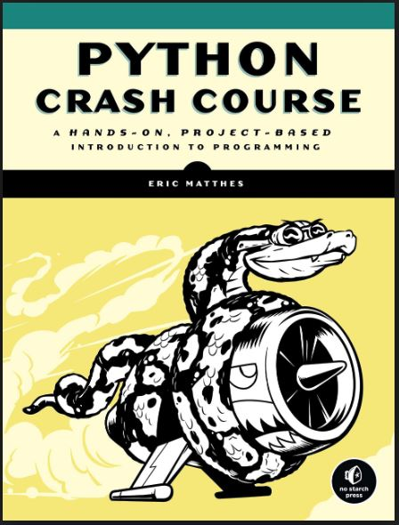

# Python Crash Course
In this repository, I solve all the problems that appear in [Python Crash Course](https://pythonbooks.org/python-crash-course-a-hands-on-project-based-introduction-to-programming/) by Eric Matthes.
The problem corresponding to each solution is commented next to each block of code. This was a personal goal of mine to teach myself how to program in Python after teaching myself VBA and macros in Excel.
I am thankful of the knowledge I learned from this book as it is the cornerstone to the good programming practices I use today.

## Book Cover

	</img>

